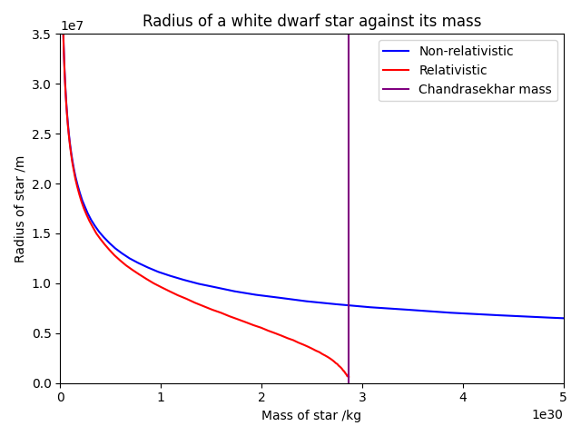

# neutron-star-simulation
The aim of this project was to use fourth order Runge-Kutta numerical integration to find the Chandrasekhar limit for white dwarfs. This limit places an upper bound on the mass of white dwarf stars.
To do this, I constructed a system of 2 coupled differential equations based on the forces acting on the star, which are gravity and electron degeneracy pressure.
The first equation describes the change in density, $\rho$, with radial distance outward, $r$:

$$ \frac{d\rho}{dr} = -\frac{d\rho}{dP} \frac{G\rho(r)m(r)}{r^2} $$

where the $P$ is the electron degeneracy pressure, $m(r)$ is the mass of the star within a sphere of radius $r$, and $G$ is the gravitational constant. The factor $\frac{d\rho}{dP}$ can be calculated using statistical mechanics and special relativity.
The next equation describes mass and is geometric:

$$ 
\frac{dm(r)}{dr} = 4\pi r^2 \rho(r)
$$

These two equations can be solved using the fourth order Runge-Kutta algorithm. By testing different critical densities (the density at the centre of the star), the program can find the mass and radius of the star. The Chandrasekhar limit occurs when the radius becomes 0.

## Testing the RK4 algorithm

|   $\Delta r$ |   Number of steps |    Runtime | Percentage error   |
|-------------:|------------------:|-----------:|:-------------------|
|         1000 |             50000 | 52.9135    | 0.00%              |
|        10000 |              5000 |  4.65882   | 0.01%              |
|        20000 |              2500 |  2.56432   | 0.02%              |
|        30000 |              1666 |  1.70635   | 0.11%              |
|        50000 |              1000 |  1.00153   | 0.67%              |
|       100000 |               500 |  0.443474  | 16.78%             |
|       200000 |               250 |  0.242048  | 85.96%             |
|       300000 |               166 |  0.135154  | 297.21%            |
|       500000 |               100 |  0.0969134 | 1738.93%           |

The above table shows how the quickly the percentage error diverges by using less steps. For the purpose of finding an accurate answer, this demonstrates a benchmark of 4.65 seconds for a 0.01% error, which, while not suitable for large scale tasks, is useful for finding accurate answers fast. On the flip, the run time also diverges very quickly using this method for too many steps, going as $\mathcal{O}(n)$.
